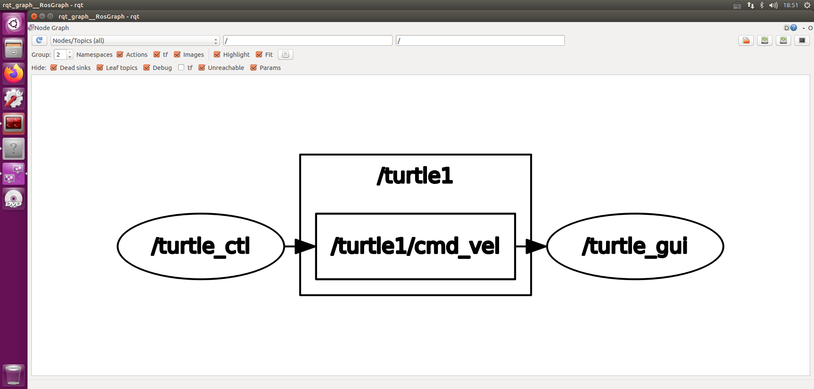

# ROS Command-line tools

[ROS](http://wiki.ros.org/ROS)[/CommandLineTools](http://wiki.ros.org/action/fullsearch/ROS/CommandLineTools?action=fullsearch&context=180&value=linkto%3A"ROS%2FCommandLineTools")

## Common user tools

### rosbag

[rosbag](http://wiki.ros.org/rosbag) is a command-line tool for performing various operations on ROS [bag files](http://wiki.ros.org/Bags), including playing, recording, and validating.

### ros_readbagfile

See [ROS/Tutorials/reading msgs from a bag file](http://wiki.ros.org/ROS/Tutorials/reading msgs from a bag file) for help and a tutorial on how to use the 3rd-party `ros_readbagfile` command-line tool.

### rosbash

[rosbash](http://wiki.ros.org/rosbash) is not a command, but rather a suite of commands and functionality. It requires that you source the contents of the rosbash file

```
source $ROS_ROOT/tools/rosbash/rosbash
```

which, if you followed the installation guide, should already be done by your bashrc file.

rosbash provides the commands `roscd` and `rosed`, in addition to adding correct tab-completion functionality to `roscd`, `rosed`, `rosmake`, and `rosrun`.

### roscd

`roscd` is part of the [rosbash](http://wiki.ros.org/rosbash) suite. It allows you to cd directly to a package, stack, or common location by name rather than having to know the package path.

Usage:

```
roscd locationname[/subdir]
```

Example:

```
roscd roscpp/include
```

roscd without an argument will take you `$ROS_ROOT`. In addition to your packages and stacks, there are some common locations, "log", and "test_results" which will take you directly to those locations.

For advanced users, you can extend `roscd` with your own keywords by modifying the `$ROS_LOCATIONS` environment variable to contain a colon-separated list of keys and locations that will be included in the roscd path. For example,

```
export $ROS_LOCATIONS="rospkg=/path/to/rospkg:stairpkg=/path/to/stairpkg"
```

Prior to ROS-0.8, you could roscd to the first directory on your `$ROS_PACKAGE_PATH` using the pkg keyword. This functionality can be restored with:

```
export $ROS_LOCATIONS="pkg=$ROS_PACKAGE_PATH"
```

### rosclean

**New in C Turtle**

Cleanup filesystem resources (e.g. log files) created by ROS. See [rosclean](http://wiki.ros.org/rosclean).

### roscore

[roscore](http://wiki.ros.org/roscore) runs the ROS Core Stack ([Master](http://wiki.ros.org/Master), [Parameter Server](http://wiki.ros.org/Parameter Server), [rosout](http://wiki.ros.org/rosout), etc...).

### rosdep

Documented at [rosdep](http://wiki.ros.org/rosdep), this installs system dependencies

Usage:

```
rosdep install PACKAGE_NAME
```

### rosed

`rosed` is part of the [rosbash](http://wiki.ros.org/rosbash) suite. It allows you to directly edit a file within a package by package name rather than having to know the package path.

Usage:

```
rosed packagename filename
```

Example:

```
rosed roscpp ros.h
```

If the filename is not uniquely defined within the package, a menu will prompt you to choose which of the possible files you want to edit.

`rosed` will open the editor defined in your `$EDITOR` environmental variable, or else default to `vim`.

### roscreate-pkg

`roscreate-pkg` creates common [Manifest](http://wiki.ros.org/Manifest), [CMakeLists](http://wiki.ros.org/CMakeLists), [Doxygen](http://wiki.ros.org/Doxygen) and other files necessary for a new ROS package. It is part of the [roscreate](http://wiki.ros.org/roscreate) package.

### roscreate-stack

`roscreate-stack` creates common [Stack Manifest](http://wiki.ros.org/Stack Manifest), [CMakeLists](http://wiki.ros.org/CMakeLists) and other files necessary for a new ROS stack. It is part of the [roscreate](http://wiki.ros.org/roscreate) package.

### rosrun

`rosrun` allows you to run an executable in an arbitrary package without having to cd (or roscd) there first.

Usage:

```
rosrun package executable
```

Example:

```
rosrun roscpp_tutorials talker
```

### roslaunch

[roslaunch](http://wiki.ros.org/roslaunch) launches a set of nodes from an XML configuration file and includes support for launching on remote machines. More documentation is available on the [roslaunch page](http://wiki.ros.org/roslaunch).

### roslocate

**Removed in ROS 1.4: this is now part of the [rosinstall](http://wiki.ros.org/rosinstall) tool**

[roslocate](http://wiki.ros.org/roslocate) finds the repository that a ROS package is stored in, e.g. `roslocate svn tf`. It makes it easy to quickly checkout the source of a package: `svn co `roslocate svn tf``. More documentation is available on the [roslocate page](http://wiki.ros.org/roslocate).

### rosmake

See the [rosmake](http://wiki.ros.org/rosmake) page.

### rosmsg

[rosmsg](http://wiki.ros.org/rosmsg) displays [Message](http://wiki.ros.org/Message) data structure definitions. More documentation is available on the [rosmsg page](http://wiki.ros.org/rosmsg).

### rosnode

[rosnode](http://wiki.ros.org/rosnode) displays runtime node information and lets you ping nodes to check connectivity. More documentation is available on the [rosnode page](http://wiki.ros.org/rosnode).

### rospack

See the [rospack](http://wiki.ros.org/rospack) page.

### rosparam

[rosparam](http://wiki.ros.org/rosparam) enables getting and setting parameter server values from the command-line using YAML-encoded text.

### rossrv

[rossrv](http://wiki.ros.org/rossrv) displays Service [srv](http://wiki.ros.org/srv) data structure definitions. More documentation is available on the [rossrv page](http://wiki.ros.org/rossrv).

### rosservice

[rosservice](http://wiki.ros.org/rosservice) displays run-time information about [Services](http://wiki.ros.org/Services) and also lets you print out messages being sent to a topic. More documentation is available on the [rosservice page](http://wiki.ros.org/rosservice).

### rosstack

See the [rosstack](http://wiki.ros.org/rosstack) page.

### rostopic

[rostopic](http://wiki.ros.org/rostopic) displays run-time information about [Topics](http://wiki.ros.org/Topics) and also lets you print out messages being sent to a topic. More documentation is available on the [rostopic page](http://wiki.ros.org/rostopic).

### rosversion

## Graphical tools

The ROS graphical tools often require additional dependencies before they can be used, such as graphviz and Python GTK. You can use `bash <(rosdep satisfy PACKAGE_NAME)` to quickly install the dependencies for these tools.

### rqt_bag

[rqt_bag](http://wiki.ros.org/rqt_bag) is a graphical tool for viewing data in ROS [bag files](http://wiki.ros.org/Bags).

### rqt_deps

[rqt_deps](http://wiki.ros.org/rqt_deps) generates a PDF of ROS dependencies.

### rqt_graph

`rqt_graph` displays an interactive graph of ROS nodes and topics. See the [rosgraph](http://wiki.ros.org/rosgraph) package for documentation.

如果工具未安装，可以使用以下命令安装：

```shell
# <distro>替换为对应的ROS版本，如：kinetic
$ sudo apt install ros-<distro>-rqt
$ sudo apt install ros-<distro>-rqt-common-plugins
```

在节点运行后，在命令行输入`rqt_graph`和`rosrun rqt_graph rqt_graph`，即可看到表示各节点之间关系的网络拓扑图。

```shell
$ rqt_graph
# 或者
$ rosrun rqt_graph rqt_graph
```



### rqt_plot

[rqt_plot](http://wiki.ros.org/rqt_plot) plots numerical data on a ROS topic over time.

## Less-used tools

The following tools may be commonly used by internal tools, but aren't often used by end users.

### gendeps

See the [roslib](http://wiki.ros.org/roslib) page