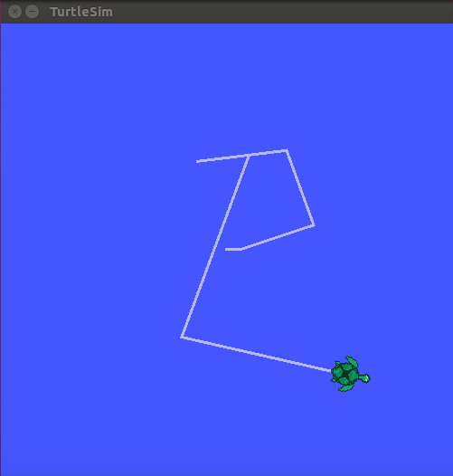
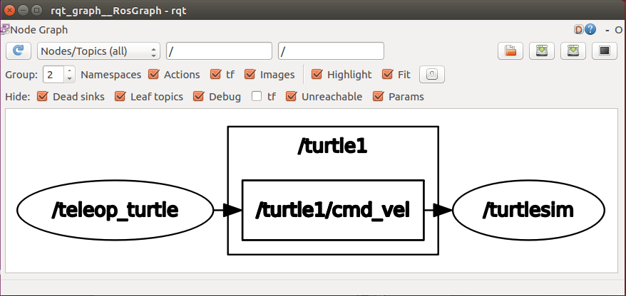
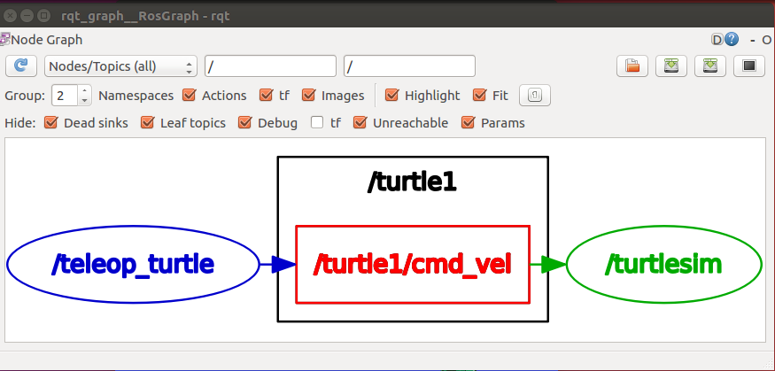
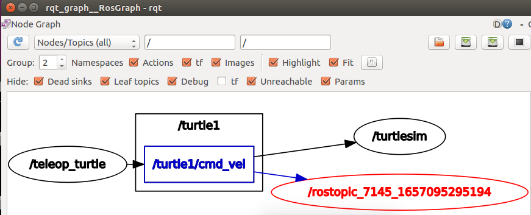
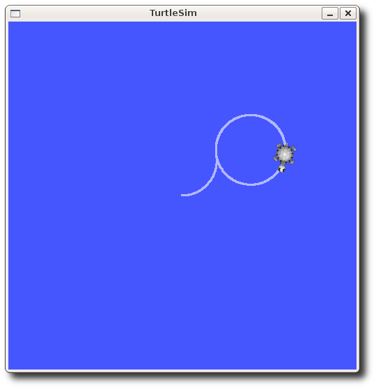
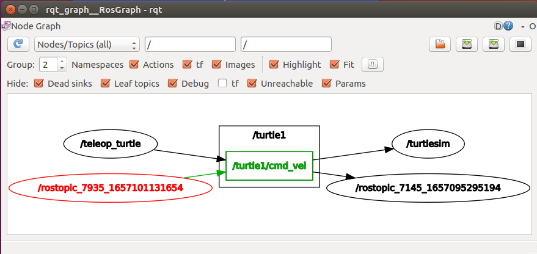
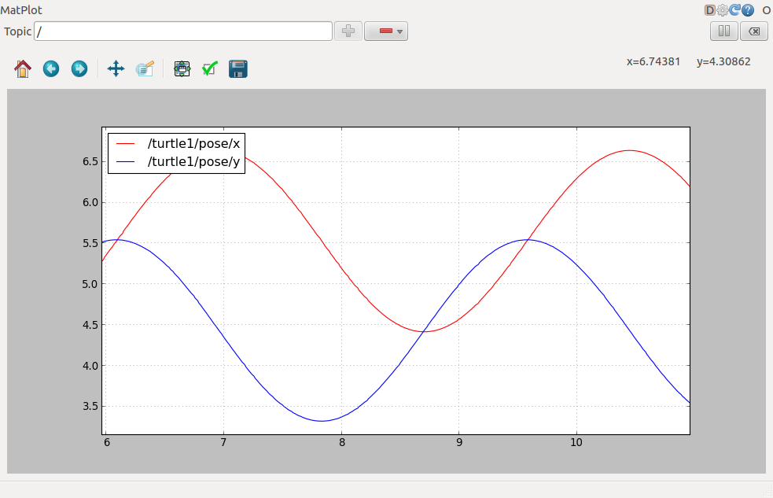
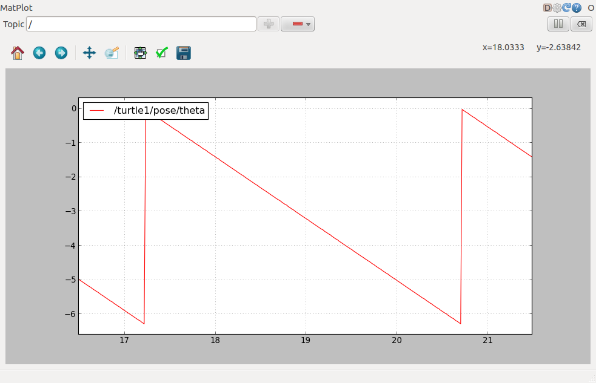

# Understanding ROS Topics

[ROS](https://wiki.ros.org/ROS)/ [Tutorials](https://wiki.ros.org/ROS/Tutorials)/ [UnderstandingTopics](http://wiki.ros.org/action/fullsearch/ROS/Tutorials/UnderstandingTopics?action=fullsearch\&context=180\&value=linkto%3A%22ROS%2FTutorials%2FUnderstandingTopics%22)

**描述**：介绍 ROS 话题（Topics），以及 [rostopic](http://wiki.ros.org/rostopic) 和 [rqt\_plot](http://wiki.ros.org/rqt\_plot) 命令行工具使用。

**下一节**：[Understanding ROS services and parameters](./ros-tutorials-beginner-7-understanding-services-params/)

## Setup

### roscore

打开新窗口，启动`roscore`：

```shell
$ roscore
```

如果`roscore`已经启动，将提示以下错误信息：

```shell
roscore cannot run as another roscore/master is already running. 
Please kill other roscore/master processes before relaunching.
The ROS_MASTER_URI is http://ml-ros-kinetic:11311/
The traceback for the exception was written to the log file
```

这是正常的，因为有且仅需要一个`roscore`。

### turtlesim

在这一部分，我们将用到`turtlesim`功能包（包含在`ros_tutorials`元功能包中）。开启新命令窗口输入以下命令启动`turtlesim gui`：

```shell
$ rosrun turtlesim turtlesim_node
```

### turtle keyboard teleoperation

为了控制乌龟运动，在新窗口运行：

```shell
$ rosrun turtlesim turtle_teleop_key
```

```shell
Reading from keyboard
---------------------------
Use arrow keys to move the turtle.
```

现在就可以通过方向键控制乌龟移动。如果乌龟没有移动，请先确保当前鼠标焦点在`turtle_teleop_key`所在的窗口。



下面将讲述其背后的原理和实现。

## ROS Topics

`turtlesim_node`和`turtle_teleop_key` 通过ROS **Topic**进行通信。`turtle_teleop_key` 在话题中**发布**当前按下的方向键信息，`turtlesim_node`**订阅**相同的话题以获得当前按键信息。使用`rqt_graph`可以展示当前节点和话题的关系。

Note: 如果使用的是`electric` 会更早版本，`rqt`是不可用的。可以使用`rxgraph`代替。

### Using rqt\_graph

`rqt_graph`会创建当前系统运行的节点和话题的动态图。`rqt_graph`是`rqt`功能包的一部分。如果尚未安装，可以输入：

```shell
$ sudo apt-get install ros-<distro>-rqt
$ sudo apt-get install ros-<distro>-rqt-common-plugins
```

replacing with the name of your [ROS distribution](http://wiki.ros.org/Distributions) (e.g. indigo, jade, kinetic, lunar ...)

打开新窗口，输入：

```shell
$ rosrun rqt_graph rqt_graph
```

将会弹出以下类似窗口：



如果将鼠标悬停在`/turtle1/com_vel`，图形将会高亮，节点显示为蓝色和绿色，话题显示为红色。正如图片表示的那样， `turtlesim_node` 和 `turtle_teleop_key` 通过 `/turtle1/com_vel`话题通信。



### Introducing rostopic

使用 `rostopic` 命令行工具可以获取ROS **话题**（topics） 相关信息。

可以使用帮助选项`-h`获取可用的子命令：

```shell
$ rostopic -h
```

```shell
rostopic bw     display bandwidth used by topic
rostopic echo   print messages to screen
rostopic hz     display publishing rate of topic    
rostopic list   print information about active topics
rostopic pub    publish data to topic
rostopic type   print topic type
```

或者在`rostopic`后面按下`tab`键，打印可能的子命令：

```shell
$ rostopic 
bw    echo  find  hz    info  list  pub   type 
```

### Using rostopic echo

`rostopic echo`能够展示话题发布的数据。

Usage：

```shell
$ rostopic echo [topic]
```

查看`turtle_teleop_key`节点发布的数据。

对于 **ROS Hydro** 以及之后的版本，数据发布在 `/turtle1/cmd_vel` 话题。打开新窗口，输入：

```shell
$ rostopic echo /turtle1/cmd_vel
```

对于 **ROS Groovy** 以及之前的版本，数据发布在 `/turtle1/command_velocity` 话题。打开新窗口，输入：

```shell
$ rostopic echo /turtle1/command_velocity
```

你可能不会看到任何信息，因为当前话题未发布任何信息。此时，为了看到`turtle_teleop_key`发布的信息需要继续按下方向键。**如果乌龟没有移动，请先重新选择`turtle_teleop_key`窗口。**

对于 **ROS Hydro** 以及之后的版本，在按下按键后将看到以下信息：

```
linear: 
  x: 2.0
  y: 0.0
  z: 0.0
angular: 
  x: 0.0
  y: 0.0
  z: 0.0
---
linear: 
  x: 2.0
  y: 0.0
  z: 0.0
angular: 
  x: 0.0
  y: 0.0
  z: 0.0
---
```

对于 **ROS Groovy** 以及之前的版本，在按下按键后将看到以下信息：

```
---
linear: 2.0
angular: 0.0
---
linear: 2.0
angular: 0.0
---
linear: 2.0
angular: 0.0
---
linear: 2.0
angular: 0.0
---
linear: 2.0
angular: 0.0
```

打开`rqt_graph`图形窗口，点击左上角的刷新按钮。图中红色的节点现在也订阅了 `/turtle1/cmd_vel` 话题。



### Using rostopic list

`rostopic list`返回当前订阅和发布的所有话题。

查看`rostopic list`子命令，打开新窗口，运行：

```shell
$ rostopic list -h
```

```shell
Usage: rostopic list [/namespace]

Options:
  -h, --help		   show this help message and exit
  -b BAGFILE, --bag=BAGFILE
  					list topics in .bag file
  -v, --verbose             list full details about each topic
  -p                              list only publishers
  -s                               list only subscribers
  --host                        group by host name
```

使用`rostopic list`下的**verbose**选项：

```shell
$ rostopic list -v
```

将展示当前订阅和发布的话题以及他们的消息类型。

对于 **ROS Hydro** 以及之后的版本:

```shell
Published topics:
 * /turtle1/color_sensor [turtlesim/Color] 1 publisher
 * /turtle1/cmd_vel [geometry_msgs/Twist] 1 publisher
 * /rosout [rosgraph_msgs/Log] 4 publishers
 * /rosout_agg [rosgraph_msgs/Log] 1 publisher
 * /turtle1/pose [turtlesim/Pose] 1 publisher

Subscribed topics:
 * /turtle1/cmd_vel [geometry_msgs/Twist] 2 subscribers
 * /rosout [rosgraph_msgs/Log] 1 subscriber
 * /statistics [rosgraph_msgs/TopicStatistics] 1 subscriber
```

## ROS Messages

ROS节点间的话题通信，通过发送ROS **messages**完成。对于发布者(`turtle_teleop_key`) 和订阅者(`turtlesim_node`) 之间的通信，发布者和订阅者必须发布和订阅相同的数据**类型**。这就意味着**话题类型**被定义为发布的**消息类型**。使用`rostopic type`可以获取指定话题所发送的消息类型。

### Using rostopic type

`rostopic type`返回获取任意正在发布的话题的消息类型。

Usage:

```shell
$ rostopic type [topic]
```

对于 **ROS Hydro** 以及之后的版本:

打开新窗口，输入：

```shell
$ rostopic type /turtle1/cmd_vel
```

```
geometry_msgs/Twist
```

使用`rosmsg`查看消息的详细定义：

```shell
$ rosmsg show geometry_msgs/Twist
```

```shell
geometry_msgs/Vector3 linear
  float64 x
  float64 y
  float64 z
geometry_msgs/Vector3 angular
  float64 x
  float64 y
  float64 z
```

在已知`turtlesim`接受的消息类型后，我们可以发布相应的消息内容给我们的乌龟。

## rostopic continued

### Using rostopic pub

使用`rostopic pub`发布`/turtle1/cmd_vel`话题所需要的数据。

Usage：

```shell
$ rostopic pub [topic] [msg_type] [args]
```

对于 **ROS Hydro** 以及之后的版本，输入:

```shell
$ rostopic pub -1 /turtle1/cmd_vel geometry_msgs/Twist -- '[2.0, 0.0, 0.0]' '[0.0, 0.0, 1.8]'
```

这一指令将发布一次消息给`turtlesim`，指引乌龟以2.0的线速度和1.8的角速度运动。


这是一条较为复杂的指令，下面将给出详细的解释.

对于 **ROS Hydro** 以及之后的版本，这一命令将发布消息给特定的话题：

```shell
rostopic pub
```

`-1`这一选项表示，仅发布一次消息然后退出：

```
 -1 
```

以下是本次发布消息的话题名称：

```
/turtle1/cmd_vel
```

以下是该话题的消息类型：

```
geometry_msgs/Twist
```

这里的双破折号`--`选项告诉解析器，后面的参数不是可选项。如果您的参数具有前导破折号“-”（如负数），那么就会出现双破折号的情况。

```
--
```

前面已经提到，`geometry_msgs/Twist`消息有两个长度为三的浮点数组：`linear` 和 `angular`。在这个例子中，`'[2.0, 0.0, 0.0]'` 将为线速度`linear`赋值为`x=2.0`, `y=0.0`, 和`z=0.0`, `'[0.0, 0.0, 1.8]'`将为角速度 `angular`赋值为 `x=0.0`, `y=0.0`, 和 `z=1.8`。这是符合**YAML** 语法的格式，详细内容请参见 [YAML command line documentation](http://wiki.ros.org/ROS/YAMLCommandLine).

```
'[2.0, 0.0, 0.0]' '[0.0, 0.0, 1.8]' 
```

值得注意的是，乌龟运动一会后会自动停下来。为了使乌龟持续的运动下去，需要通过 `rostopic pub -r`持续发布稳定的消息流。

对于 **ROS Hydro** 以及之后的版本：

```shell
$ rostopic pub /turtle1/cmd_vel geometry_msgs/Twist -r 1 -- '[2.0, 0.0, 0.0]' '[0.0, 0.0, -1.8]'
```

这一条速度发布指令的速率是**1Hz**。



在`rqt_graph`的图形界面中，我们可以清楚看到各节点以及话题之间的关系。这里的红色节点，即为当前发布速度消息的节点。



在`turtlesim`的图形界面中，能清楚的看到小乌龟沿着一个连续的圆运动。打开一个新窗口，使用`rostopic echo`来查看乌龟的位姿信息：

```shell
$ rostopic echo /turtle1/pose
```

### Using rostopic hz

`rostopic hz` 命令可以监控消息发布的频率。

Usage:

```shell
$ rostopic hz [topic]
```

查看`turtlesim_node` 正在发布`/turtle1/pose`的频率:

```shell
$ rostopic hz /turtle1/pose
```

可以得到以下信息：

```shell
subscribed to [/turtle1/pose]
average rate: 62.410
	min: 0.015s max: 0.017s std dev: 0.00055s window: 62
average rate: 62.487
	min: 0.015s max: 0.017s std dev: 0.00056s window: 124
average rate: 62.469
	min: 0.014s max: 0.019s std dev: 0.00062s window: 187
average rate: 62.480
	min: 0.014s max: 0.019s std dev: 0.00063s window: 249
```

可以看出，当前`turtlesim`发布位姿消息的频率大概为62 Hz。同样的，我们可以使用`rostopic type` 和 `rosmsg show` 联合的方式获取消息的详细定义：

对于 **ROS Hydro** 以及之后的版本：

```shell
$ rostopic type /turtle1/cmd_vel | rosmsg show
```

## Using rqt\_plot

`rqt_plot`显示有关主题的已发布数据随时间推进的图。在这里，我们将使用`rqt_plot`来绘制在 `/turtle1/pose` 主题上发布的数据。在新窗口通过输入以下内容，打开`rqt_plot`图形界面：

```shell
$ rosrun rqt_plot rqt_plot
```

在左上角的文本框，可以输入任何想要绘制的话题数据。输入 `/turtle1/pose/x` ，点击高亮的**加号**按钮，或者直接回车。按同样的方式添加 `/turtle1/pose/y`。很快就可以看到 `x-y`坐标绘制在图中。



点击减号➖，下拉选择需要隐藏的绘图。隐藏前面添加的话题内容，添加`/turtle1/pose/theta`以形成如下绘图。



## Reference

1. http://wiki.ros.org/ROS/Tutorials/UnderstandingTopics
