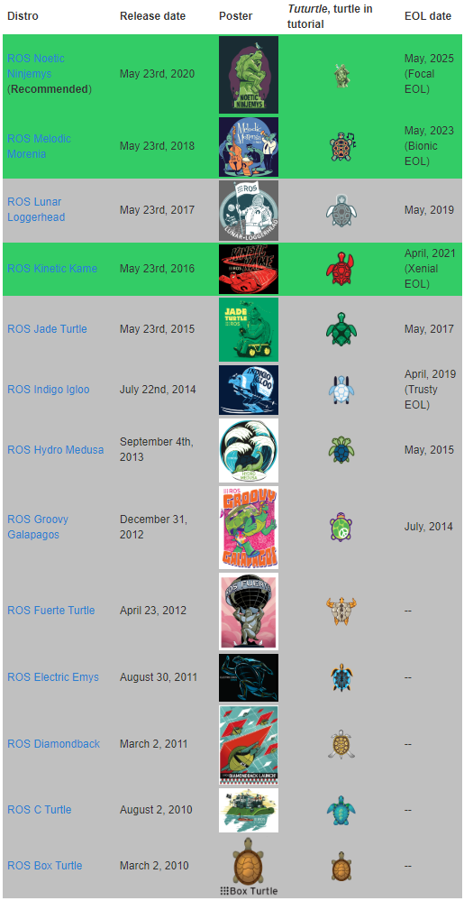

# ROS Overview

ROS（_Robot Operating System_）提供了一系列的 **库** 和 **开发工具** 以帮助开发者更好的创建机器人应用，包括硬件抽象、设备驱动、库文件、可视化工具、消息传递以及包管理等。ROS基于BSD开源许可。

### History

ROS是一个由来已久、贡献者众多的大型软件项目。在ROS诞生之前，很多学者认为，机器人研究需要一个开放式的协作框架，并且已经有不少类似的项目致力于实现这样的框架。在这些工作中，斯坦福大学在2000年年中开展了一系列相关研究项目，如斯坦福人工智能机器人（STandford AI Robot, STAIR）项目、个人机器人（Personal Robots, PR）项目等，在上述项目中，在研究具有代表性、集成式人工智能系统的过程中，创立了用于室内场景的高灵活性、动态软件系统，其可以用于机器人学研究。

2007年，柳树车库（Willow Garage）提供了大量资源，用于将斯坦福大学项目中的软件系统进行扩展与完善，同时，在无数研究人员的共同努力下，ROS的核心思想和基本软件包逐渐得到完善。

### What is ROS?

ROS 是一个为机器人设计的**开源**的**元操作系统**。它提供了与操作系统类似的服务，包括硬件抽象、底层设备控制、常用功能的实现、进程间通信和功能包管理。实际上，可以将ROS 看作一个 SDK(software development kit)，提供提供了用于在多主机上获取、生成、编写和运行代码的工具和库。

ROS 的主要目标是为机器人研究和开发提供代码复用的支持。ROS是一个分布式的进程（也就是“节点”）框架，这些进程被封装在易于被分享和发布的程序包和功能包中。ROS也支持一种类似于代码储存库的联合系统，这个系统也可以实现工程的协作及发布。这个设计可以使一个工程的开发和实现从文件系统到用户接口完全独立决策（不受ROS限制）。同时，所有的工程都可以被ROS的基础工具整合在一起。

ROS设计者将ROS表述为“ROS = Plumbing + Tools + Capabilities + Community”，即ROS是通讯机制、工具软件包、机器人高层技能以及机器人社区的集合体。

**通信机制（Plumbing）**：ROS提供了一种发布-订阅式的通信框架用以简单、快速地构建分布式计算系。

**工具（Tools）**：ROS提供了大量的工具组合用以配置、启动、自检、调试、可视化、登录、测试、终止分布式计算系统。

**强大的库（Capabilities）**：ROS提供了广泛的库文件实现以机动性、操作控制、感知为主的机器人功能。

**开源社区（Community）**：ROS的支持与发展依托着一个强大的社区。ros.org尤其关注兼容性和支持文档，提供了一套“一站式”的方案使得用户得以搜索并学习来自全球开发者数以千计的ROS程序包。

### Goals

ROS 的目标并不是成为多功能的框架，而是希望在机器人研发过程中，代码复用、技术共享以及协同开发。

**代码复用（reuse）**：支持机器人研发过程中代码复用。

**分布式框架（distributed framework）**：分布式运行保证系统中各节点的松耦合，独立开发实现节点功能以提高开发效率。

**精简（thin）**：ROS 被设计为尽可能精简，以便为 ROS 编写的代码可以与其他机器人软件框架一起使用。即 ROS 很容易与其他机器人软件框架集成：ROS 已经与 Open RAVE、Orocos 和 Player 集成。

**与 ROS 无关的库（ROS-agnostic libraries）**：首选的开发模型是编写具有干净功能接口的与 ROS 无关的库。这样就算脱离 ROS ，仍然可以在其他机器人框架或者平台上完成相应功能。

**语言独立性（language independence）**：ROS 框架很容易用任何现代编程语言实现。可以使用 Python、C++ 和 Lisp 编码实现，并且有 Java 和 Lua 的支持计划。

**易于测试（easy testing）**：ROS 有一个称为 rostest 的内置单元/集成测试框架，可以轻松启动和拆除测试夹具。

**可扩展性（scaling）**：ROS 适用于大型运行时系统和大型开发过程。

### Releases

核心 ROS 系统以及有用的工具和库会定期作为 ROS 发行版发布。ROS的发行版类似于 Linux 发行版，并提供一组兼容的软件供开发者使用和构建。推出ROS发行版本的目的在于使开发人员可以使用相对稳定的代码库，直到其准备好将所有内容进行版本升级为止。因此，每个发行版本推出后，ROS开发者通常仅对这一版本的bug进行修复，同时提供少量针对核心软件包的改进。

版本特点: 按照英文字母顺序命名，ROS 目前已经发布了ROS1 的终极版本: noetic，并建议后期过渡至 ROS2 版本。noetic 版本之前默认使用的是 Python2，noetic 支持 Python3。

建议版本: noetic 或 melodic 或 kinetic

### Reference

1. [wiki.ros.org](http://wiki.ros.org/)
2. [ROS: Home](https://www.ros.org/)
3. [ros（机器人操作系统）\_百度百科 (baidu.com)](https://baike.baidu.com/item/ros/4710560)
